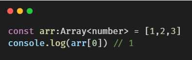

# 数据类型

##### 11种数据类型
1.  `undefined`
2.  `number`
3.  `string`
4.  `boolean`
5.  `array`
6.  `null`
7.  `void`：空类型，一般用于方法没有返回值
8.  `any`：任意类型
9.  `enum`：枚举类型
10.  `tuple`：元类型
11.  `never`：其它类型

##### 枚举类型的声明
建议用大写字母表示声明的枚举型变量，看起来更专业。
 
 

##### any类型的声明
 
用处： 
比如，我们获取一个dom元素后，给它设置style，在js里面是不会报错的，但是在js里面，会报错。所以any类型提现了它的作用了 

##### 数组类型的声明
声明一个数组，数组中的每一个元素，都是number型： 
方法一： 
 
方法二： 
 
方法三： 
 

##### 元组类型的声明
元组属于数组的一种。如果你想给数组中的元素指定不同的类型，那么可以用元组类型声明 

##### undefined类型的声明
声明是undefined类型的时候，赋值的时候，只能赋值为undefined。否则编辑器会给出错误提示 

##### 声明一个变量是多种类型

##### void类型的声明
void类型，一般用于方法没有返回任意值的情况。 

##### never类型的声明
never类型包括null和undefined类型，代表着不会出现的值。很少用到 
 
感兴趣的可以参考[TypeScript](https://www.tslang.cn/docs/handbook/basic-types.html)文档