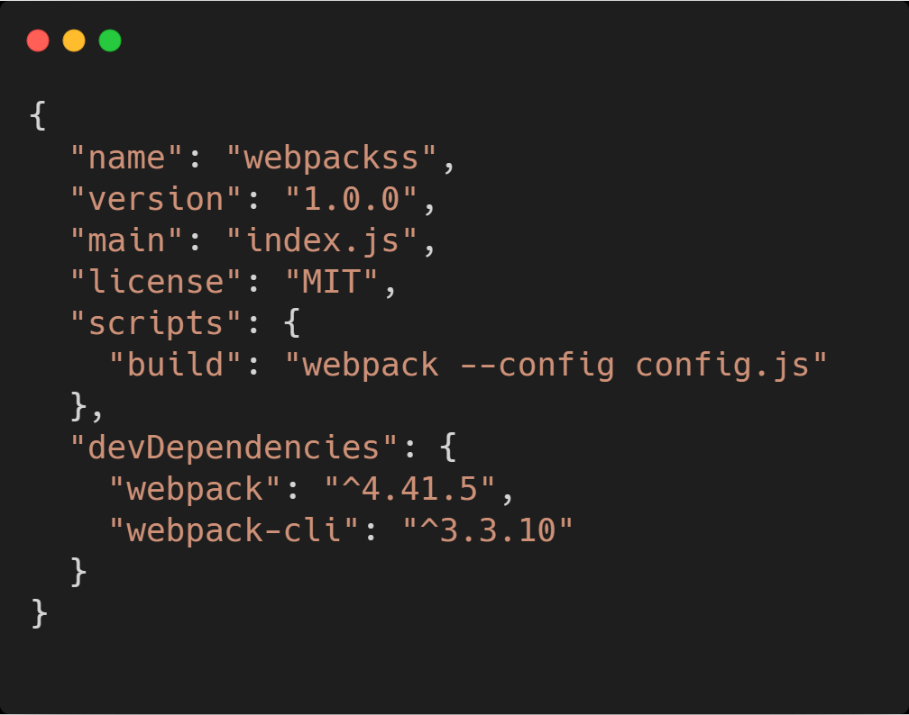

# webpack的基础配置

##### 安装
###### 1.初始化
初始化后，会生成一个package.json的默认文件

##### 2.安装webpack和webpack-cli

##### 0配置
直接在命令行运行 `npx webpack`  会自动对js文件进行打包。默认把`src/index.js`打包到`dist`目录下的`main.js`。虽然可以支持`0`配置。但是`0`配置的功能太弱了，满足不了日常需求。

##### 3.手动配置
基本的配置如图：

手动配置的时候，在项目根目录下，创建一个`webpack.config.js`文件。在终端运行`npx webpack`。会去找`node_modules`下的`webpack`目录，但是`webpack`又是依赖于`webpack-cli`的。在`webpack-cli/bin/config/config-yargs.js`中有这么一段话：`defaultDescription: "webpack.config.js or webpackfile.js"`。意思是运行`npx webpack`的时候，会去默认的找`webpack.config.js`或者`webpackfile.js`。

##### 4.添加脚本
如果想通过`npm run`来运行打包命令，则需要配置`package.json`中的`script`。然后在终端运行`npm run build`。

##### 5.自定义webpack配置文件的名称
有的时候，配置文件不想命名为`webapck.config.js`，想命名为其它名字，当然也是支持的。比如想换成`config.js`。只需要修改`package.json`中的`script`内容即可。通过`--config`指定配置文件。

